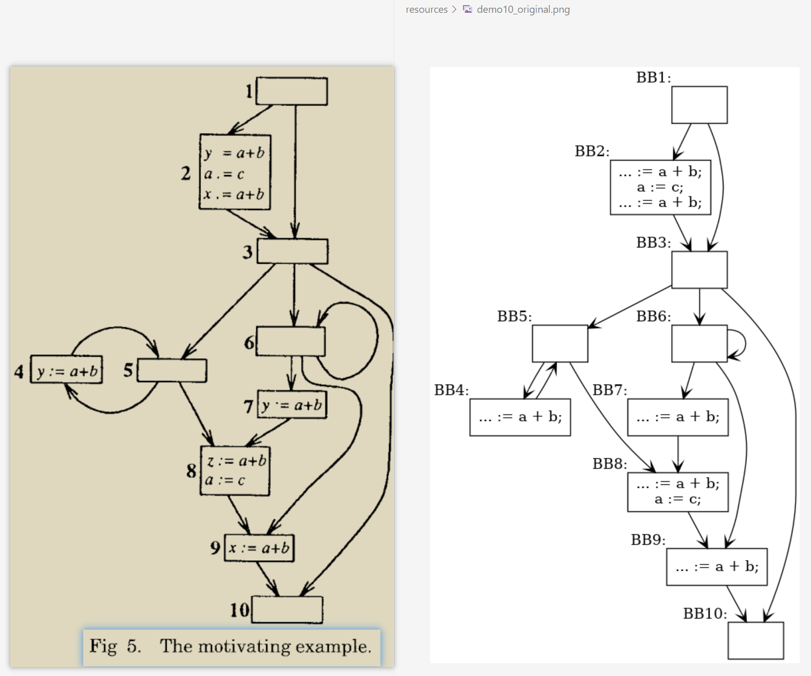
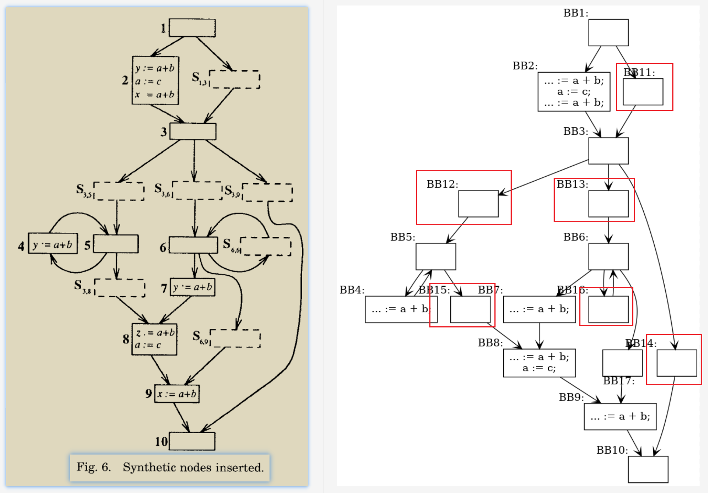
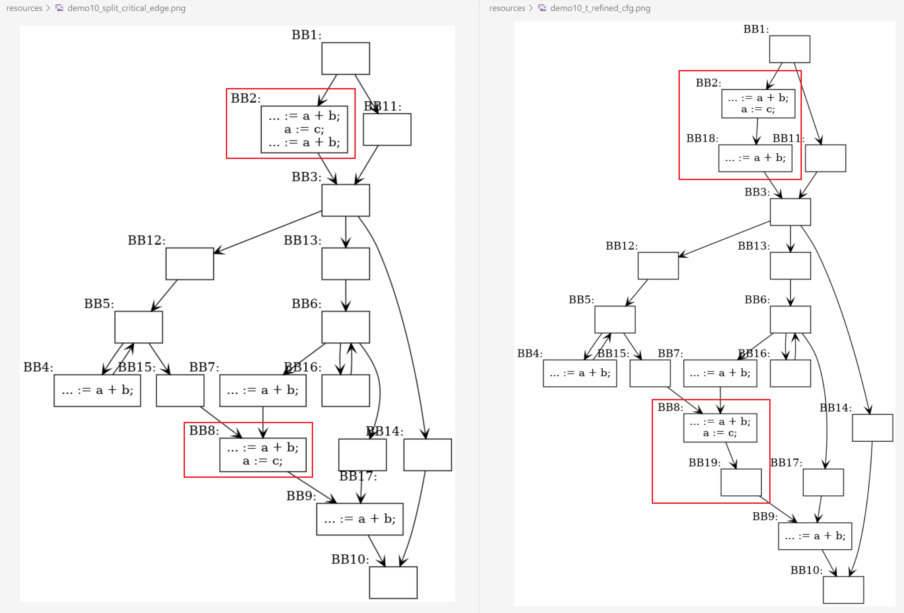
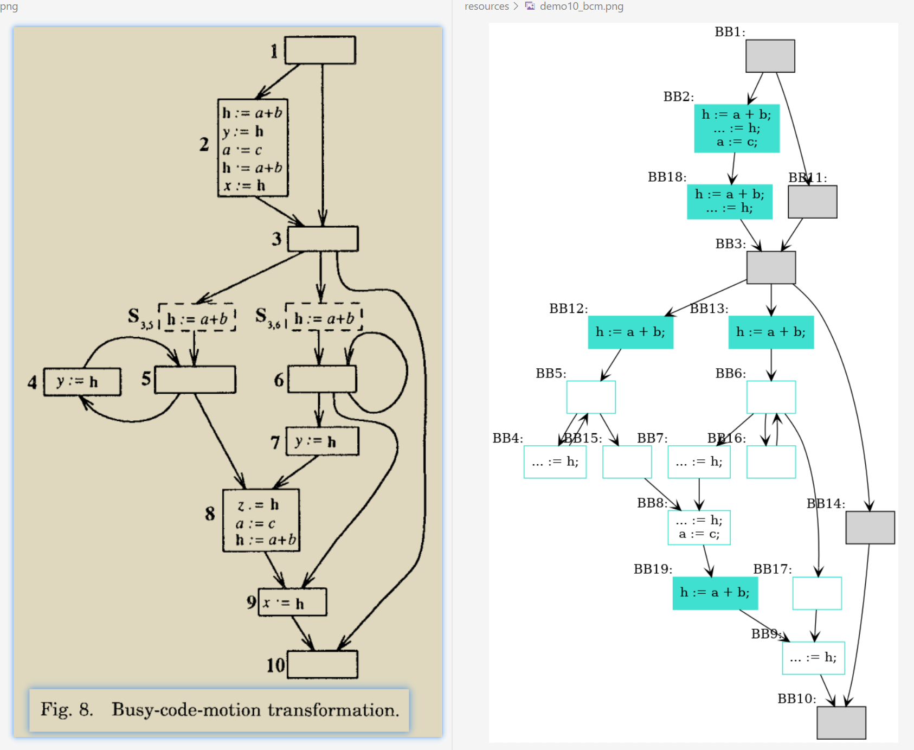
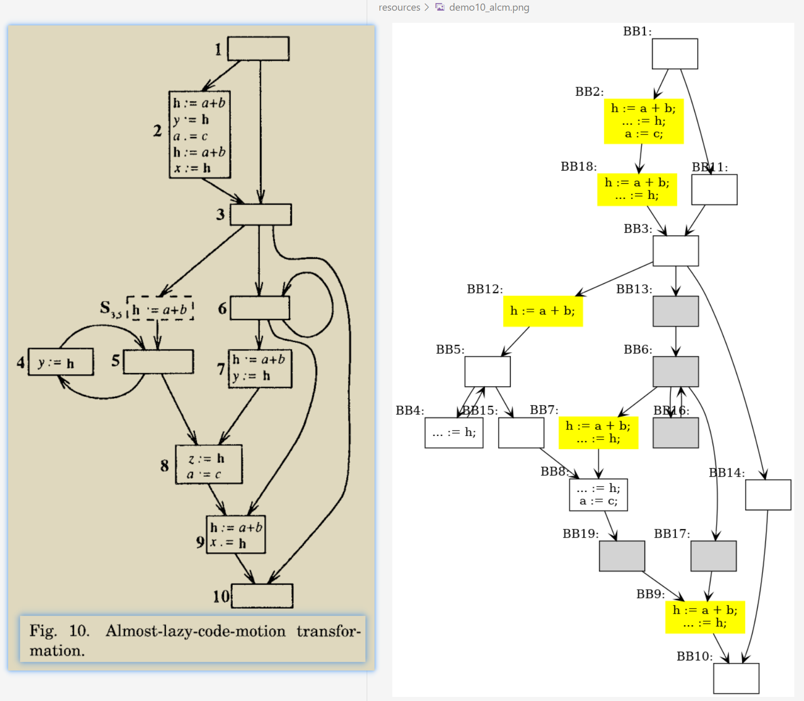
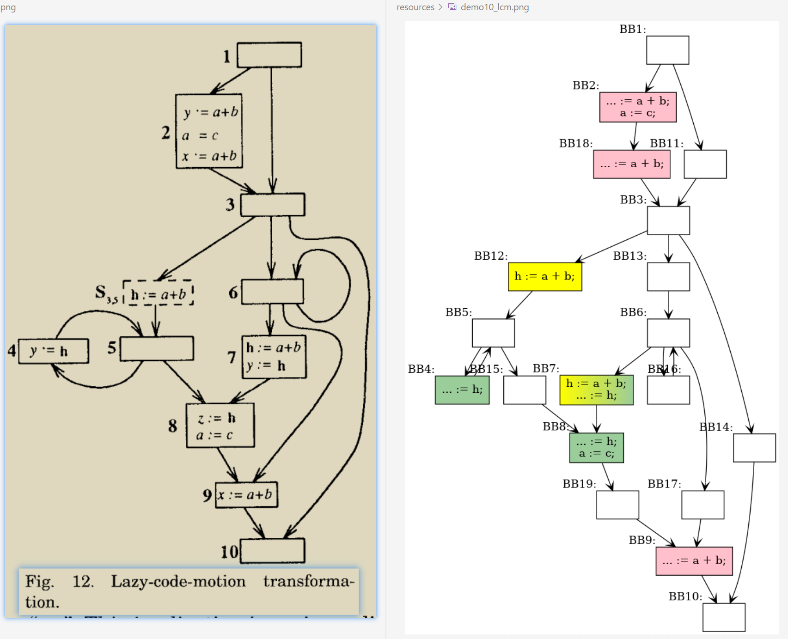

# LCM_demo
A toy implementation about **Lazy Code Motion** by zhaosiying12138@LiuYueCity Academy of Sciences.  

## 1. Usage  
```
mkdir build
cd build
cmake ..
make -j 65535
./TestLCM
dot -T png -o demo10_lcm.png demo10_lcm.dot
```

## 2. Experimental Results  
### 1. Original CFG  
  
### 2. Preprocess 1: Split Critical Edges
  
### 2. Preprocess 2: Make FlowGraph t-Refined
  
### 3. BCM Results  
  
### 4. ALCM Results  
  
### 5. LCM Results  
  

## 3. Link  
[《零基础入门不是Busy Code Motion的Lazy Code Motion》By 雾魂泉守曌鹓鶵](https://www.zhihu.com/question/640289612/answer/3368852553)  

## 4. Copyright  
Copyright (c) 2022-2024 By 流月城先进偃甲技术研究院-对伏羲外包国家重点实验室-雾魂泉守曌鹓鶵 founded by 五色石炼制关键工艺天界自然科学基金(2022LYC12138).  All rights reserved.  
